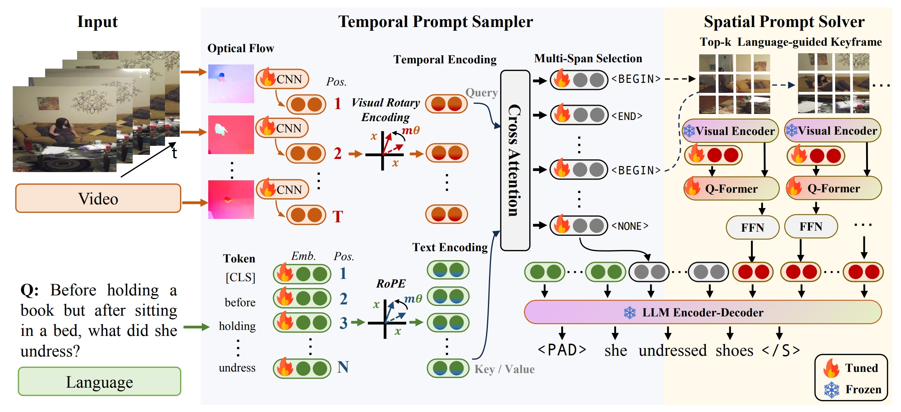
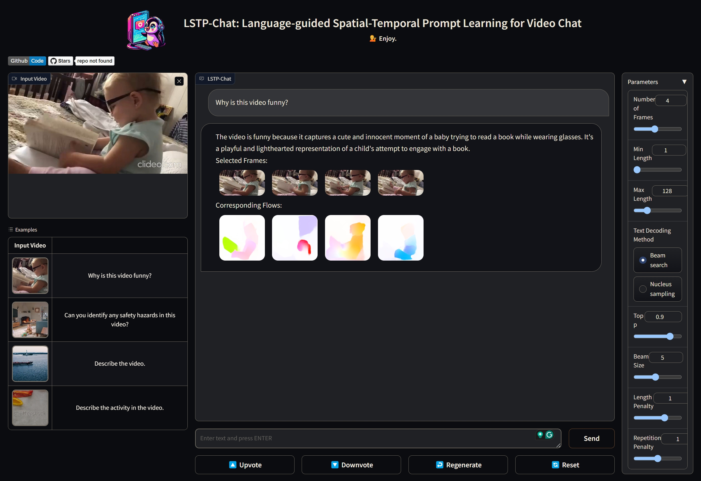

<p align="center">
    
<p>

<div align="center">

# LSTP-Chat: Language-guided Spatial-Temporal Prompt Learning for Video Chat

<a href="https://pytorch.org/get-started/locally/">
</a>
<a href="https://pytorchlightning.ai/"></a>
<a href="https://huggingface.co/docs/transformers/index/"></a>
<a href="https://hydra.cc/"></a><br>

[](https://arxiv.org/abs/2402.16050)

<!-- [](https://xxx) -->

</div>

## Updates

- (2024.02.27) Paper Release, check it on [Arxiv](https://arxiv.org/pdf/2402.16050.pdf). 
- (2024.02.26) Initial Release (´▽`ʃ♡ƪ) 

## Overview

This is a chat agent based on our work **LSTP: Language-guided Spatial-Temporal Prompt Learning for Long-form Video-Text Understanding**. This work is finetuned on video-instruction datasets [Video-ChatGPT](https://github.com/mbzuai-oryx/Video-ChatGPT/blob/main/data/README.md) and image-instruction datasets [LLaVA](https://github.com/haotian-liu/LLaVA/blob/main/docs/Data.md).

We have meticulously chosen two distinct architectural paradigms for our study: the encoder-decoder architecture, exemplified by [BLIP2-Flan-T5-xl](https://huggingface.co/Salesforce/blip2-flan-t5-xl), and the decoder-only architecture, represented by [InstructBLIP-Vicuna-7B](https://huggingface.co/Salesforce/instructblip-vicuna-7b). For further exploration, we also provide the code to tune the LLM with LoRA.



## Installation

```bash
# clone project
git clone https://github.com/bigai-nlco/LSTP-Chat
cd LSTP-Chat

# create conda environment
conda create -n LSTP
conda activate LSTP

# install requirements
pip install -r requirements.txt

```

## Data Preparation

You can download all the instruction data and evaluation data from [Video-LLaVA/DATA](https://github.com/PKU-YuanGroup/Video-LLaVA/blob/main/TRAIN_AND_VALIDATE.mdDATA)

```
inputs/ivinstruct
├── llava_image_tune
└── videochatgpt_tune
```

## How to run

*Our training framework offers tailored scripts to meet the diverse needs of researchers.*

Train model

```bash
# run on local
python src/train.py experiment=LSTP_SF_blip2flant5xl_videoinstruct # blip2-flan-t5-xl + video-instruct
python src/train.py experiment=LSTP_SF_instructblipvicuna7b_videoinstruct # instructblip-vicuna-7b + video-instruct

# run on cluster
sbatch scripts/videoinstruct_train.slurm # blip2-flan-t5-xl + video-instruct
sbatch scripts/videoinstruct_vicuna_train.slurm # instructblip-vicuna-7b + video-instruct
```

For those with limited GPU resources, we also provide the pipeline to shorten the training procudure
```bash
# step 1: generate the pseudal labels from the base-model

# step 2: train the temporal sampler
python src/train.py experiment=LSTP_TG_blip2flant5xl_videoinstruct

# step 3: train LSTP with fixed temporal sampler
python src/train.py experiment=LSTP_blip2flant5xl_ivinstruct # blip2-flan-t5-xl + video-instruct + image-instruct
python src/train.py experiment=LSTP_instructblipvicuna7b_ivinstruct # instrucblip-vicuna-7b + video-instruct + image-instruct
python src/train.py experiment=LSTP_blip2flant5xl_ivtinstruct # blip2-flan-t5-xl (LoRA) + video-instruct + image-instruct + text-instruct
python src/train.py experiment=LSTP_instructblipvicuna7b_ivtinstruct # instrucblip-vicuna-7b (LoRA) + video-instruct + image-instruct + text-instruct
```

Evaluate model

```bash
# run inference for LSTP-Vicuan-7B
bash eval/scripts/run_qa_msvd_vicuna.sh
bash eval/scripts/run_qa_msrvtt_vicuna.sh
bash eval/scripts/run_qa_activitynet_vicuna.sh

# run inference for LSTP-Flan-T5-xl
bash eval/scripts/run_qa_msvd.sh
bash eval/scripts/run_qa_msrvtt.sh
bash eval/scripts/run_qa_activitynet.sh

# run evaluation
bash eval/scripts/eval_qa_msvd.sh
bash eval/scripts/eval_qa_msrvtt.sh
bash eval/scripts/eval_qa_activitynet.sh
```

Configures

```yaml
data:
  - text_dir
  - video_dir
  - processor_name
  - sampler_processor_name
  - nframe # final sampled frames
  - target_size # image size
  - batch_size
model:
  - model_name_or_path
  - sampler_name_or_path
  - of_extractor_name_or_path
  - optimizer
  - scheduler
  - generate_configs
path:
  - data_dir
  - video_dir
  - text_dir
  - output_dir
trainer: 
  - strategy
  - accelerator
  - devices
  - num_nodes
  - precision
```

## Evaluation Results

*Metrics: Accuracy/Score*

| Methods       | LLM size | MSVD-QA       | MSRVTT-QA     | ActivityNet-QA     |
| ------------- | -------- | ------------- | ------------- | ------------------ |
| FrozenBiLM    | 1B       | 32.2/-        | 16.8/-        | 24.7/-             |
| VideoChat     | 7B       | 56.4/2.8      | 45.0/2.5      | -/2.2              |
| LLaMA-Adapter | 7B       | 54.9/3.1      | 43.8/2.7      | 34.2/2.7           |
| Video-LLaMA   | 7B       | 51.6/2.5      | 29.6/1.8      | 12.4/1.1           |
| Video-ChatGPT | 7B       | 64.9/3.3      | 49.3/2.8      | 35.2/2.7           |
| Video-LLaVA   | 7B       | 70.7/**3.9** | **59.2/3.5** | **45.3**/**3.3** |
| LSTP-7B       | 7B       | **71.3/3.9** | 57.3/3.3      | 43.9/**3.3**      |

## Demo

We provide the chat demo supported by Gradio. We also provide some checkpoints, you can download it an put it to `ckpts/LSTP-Chat/`.

Model Zoo

|Model      |Base Model      |  Training Data | Strategy for LLM | Download Link       | 
| ------------- | ------------- | -------- | -------- | ------------- |
| LSTP-7B| InstructBlip-Vicuna-7B | [Video-ChatGPT](https://github.com/mbzuai-oryx/Video-ChatGPT), [LLaVA](https://github.com/haotian-liu/LLaVA/blob/main/docs/Data.md)     | fixed       | [Huggingface](https://huggingface.co/ColorfulAI/LSTP-Chat)        | 

```bash
python -m demo.demo
```



## Acknowledgement

- Data: [Video-ChatGPT](https://github.com/mbzuai-oryx/Video-ChatGPT), [LLaVA](https://github.com/haotian-liu/LLaVA/blob/main/docs/Data.md)
- Code: [LAVIS/instructblip](https://github.com/salesforce/LAVIS/tree/main/projects/instructblip), [lightning-hydra-template](https://github.com/ashleve/lightning-hydra-template)
- Demo: [LLaVA](https://github.com/haotian-liu/LLaVA), [Video-LLaVA](https://github.com/PKU-YuanGroup/Video-LLaVA)
